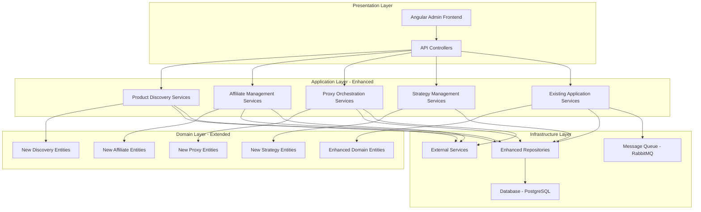
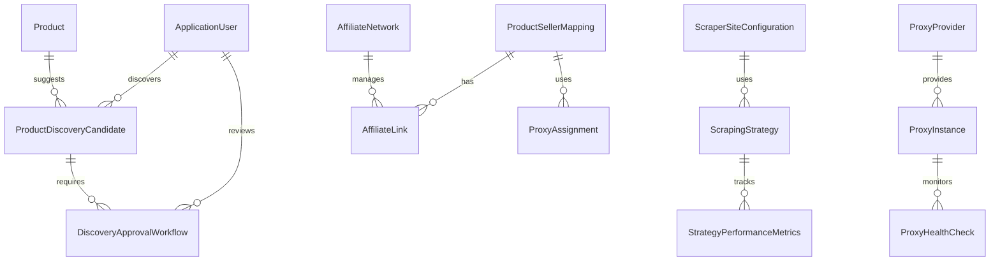
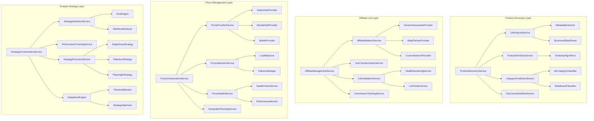
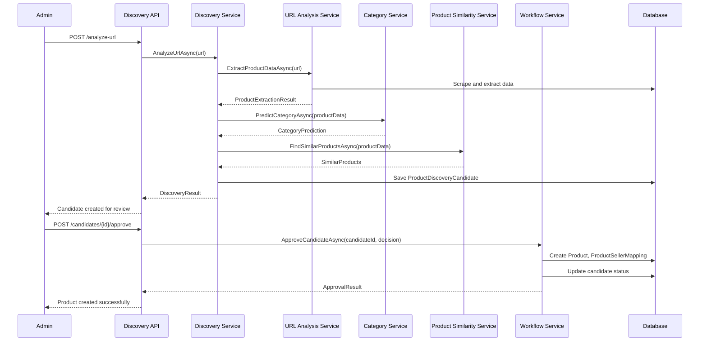
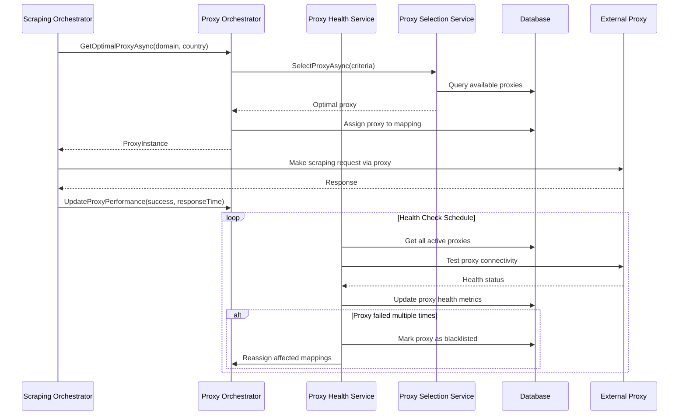
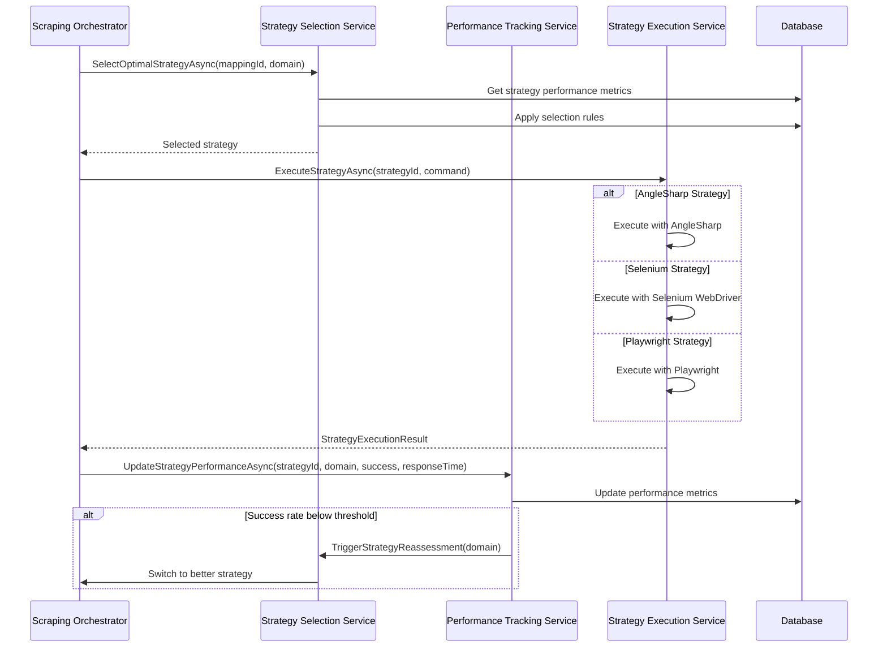
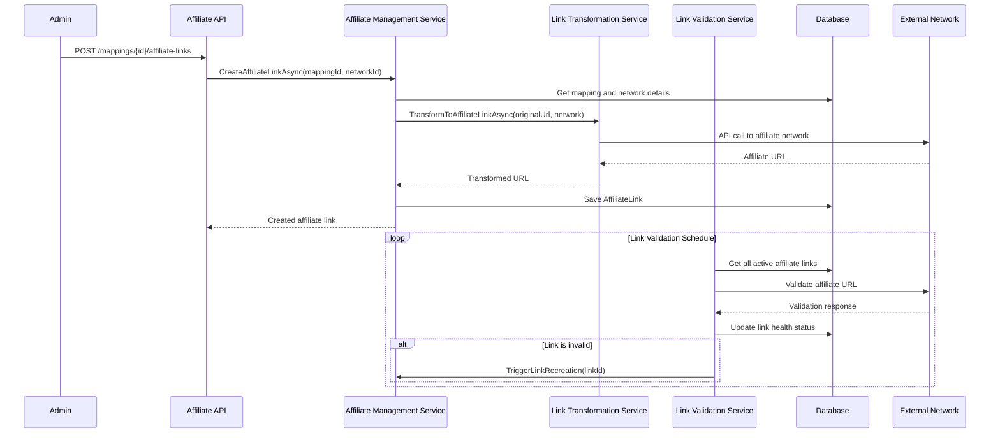

# TechTicker Advanced Features Architecture Design

**Version:** 2.0  
**Date:** June 17, 2025  
**Authors:** Architecture Team  
**Target Audience:** Development Team, Technical Leadership  

## Table of Contents

1. [Executive Summary](#executive-summary)
2. [Architecture Overview](#architecture-overview)
3. [Domain Model Extensions](#domain-model-extensions)
4. [Service Layer Architecture](#service-layer-architecture)
5. [Database Schema Changes](#database-schema-changes)
6. [API Endpoint Specifications](#api-endpoint-specifications)
7. [Message Flow Diagrams](#message-flow-diagrams)
8. [Configuration Management](#configuration-management)
9. [Integration Patterns](#integration-patterns)
10. [Implementation Roadmap](#implementation-roadmap)
11. [Non-Functional Requirements](#non-functional-requirements)

---

## Executive Summary

This document presents the comprehensive architectural design for implementing four advanced features in the TechTicker system:

1. **Automated Product Discovery (Semi-Automated)** - Intelligent product detection from URLs with admin approval workflow
2. **Affiliate Link Integration** - Multi-network affiliate link management with health monitoring and commission tracking
3. **Proxy Integration** - Multi-provider proxy management with automatic failover and geographic distribution
4. **Dynamic Evasion Strategy Adjustment** - Rule-based strategy selection with performance tracking and automatic adaptation

### Key Design Principles

- **Seamless Integration**: Leverages existing messaging infrastructure and repository patterns
- **Extensibility**: Modular design allows easy addition of new strategies, proxy providers, and affiliate networks
- **Performance**: Optimized database design with proper indexing and efficient query patterns
- **Maintainability**: Clean separation of concerns with well-defined interfaces and dependency injection
- **Scalability**: Stateless service design enabling horizontal scaling
- **Monitoring**: Comprehensive performance tracking and health monitoring capabilities

---

## Architecture Overview

### Current Architecture Integration

The advanced features integrate seamlessly with TechTicker's existing clean architecture:



### Feature Integration Matrix

| Feature | Messaging | Database | External APIs | Worker Services |
|---------|-----------|----------|---------------|-----------------|
| Product Discovery | ✅ Analysis Commands | ✅ New Tables | ✅ ML/AI Services | ✅ Discovery Worker |
| Affiliate Links | ✅ Validation Events | ✅ New Tables | ✅ Network APIs | ✅ Validation Worker |
| Proxy Management | ✅ Health Events | ✅ New Tables | ✅ Proxy APIs | ✅ Health Worker |
| Strategy Management | ✅ Performance Events | ✅ New Tables | ❌ None | ✅ Strategy Worker |

---

## Domain Model Extensions

### New Domain Entities Overview



### 1. Product Discovery Entities

#### ProductDiscoveryCandidate

```csharp
/// <summary>
/// Represents a product discovered from a URL that requires admin review
/// </summary>
public class ProductDiscoveryCandidate
{
    [Key]
    public Guid CandidateId { get; set; }

    // Source Information
    [Required]
    [MaxLength(2048)]
    public string SourceUrl { get; set; } = null!;

    // Extracted Product Data
    [Required]
    [MaxLength(500)]
    public string ExtractedProductName { get; set; } = null!;

    [MaxLength(100)]
    public string? ExtractedManufacturer { get; set; }

    [MaxLength(100)]
    public string? ExtractedModelNumber { get; set; }

    [Column(TypeName = "decimal(10,2)")]
    public decimal? ExtractedPrice { get; set; }

    [MaxLength(2048)]
    public string? ExtractedImageUrl { get; set; }

    public string? ExtractedDescription { get; set; }

    /// <summary>
    /// JSON object containing extracted specifications
    /// </summary>
    [Column(TypeName = "jsonb")]
    public string? ExtractedSpecifications { get; set; }

    // AI/ML Insights
    public Guid? SuggestedCategoryId { get; set; }

    [Column(TypeName = "decimal(5,4)")]
    public decimal CategoryConfidenceScore { get; set; } = 0;

    public Guid? SimilarProductId { get; set; }

    [Column(TypeName = "decimal(5,4)")]
    public decimal SimilarityScore { get; set; } = 0;

    // Discovery Metadata
    [Required]
    [MaxLength(50)]
    public string DiscoveryMethod { get; set; } = null!; // URL_ANALYSIS, BULK_IMPORT, MANUAL

    public Guid? DiscoveredByUserId { get; set; }

    [Required]
    public DateTimeOffset DiscoveredAt { get; set; }

    // Workflow Status
    [Required]
    [MaxLength(50)]
    public DiscoveryStatus Status { get; set; } = DiscoveryStatus.Pending;

    public string? RejectionReason { get; set; }

    [Required]
    public DateTimeOffset CreatedAt { get; set; }

    [Required]
    public DateTimeOffset UpdatedAt { get; set; }

    // Navigation Properties
    [ForeignKey(nameof(SuggestedCategoryId))]
    public Category? SuggestedCategory { get; set; }

    [ForeignKey(nameof(SimilarProductId))]
    public Product? SimilarProduct { get; set; }

    [ForeignKey(nameof(DiscoveredByUserId))]
    public ApplicationUser? DiscoveredByUser { get; set; }

    public ICollection<DiscoveryApprovalWorkflow> ApprovalWorkflows { get; set; } = new List<DiscoveryApprovalWorkflow>();

    // Helper Properties
    [NotMapped]
    public Dictionary<string, object>? ExtractedSpecificationsDict
    {
        get => string.IsNullOrEmpty(ExtractedSpecifications) 
            ? null 
            : JsonSerializer.Deserialize<Dictionary<string, object>>(ExtractedSpecifications);
        set => ExtractedSpecifications = value == null ? null : JsonSerializer.Serialize(value);
    }
}

public enum DiscoveryStatus
{
    Pending,
    UnderReview,
    Approved,
    Rejected,
    RequiresMoreInfo
}
```

#### DiscoveryApprovalWorkflow

```csharp
/// <summary>
/// Tracks the approval workflow for product discovery candidates
/// </summary>
public class DiscoveryApprovalWorkflow
{
    [Key]
    public Guid WorkflowId { get; set; }

    [Required]
    public Guid CandidateId { get; set; }

    [Required]
    public Guid ReviewerId { get; set; }

    [Required]
    [MaxLength(50)]
    public WorkflowAction Action { get; set; }

    public string? Comments { get; set; }

    /// <summary>
    /// JSON object containing any modifications made during approval
    /// </summary>
    [Column(TypeName = "jsonb")]
    public string? Modifications { get; set; }

    [Required]
    public DateTimeOffset ActionDate { get; set; }

    // Navigation Properties
    [ForeignKey(nameof(CandidateId))]
    public ProductDiscoveryCandidate Candidate { get; set; } = null!;

    [ForeignKey(nameof(ReviewerId))]
    public ApplicationUser Reviewer { get; set; } = null!;

    // Helper Properties
    [NotMapped]
    public Dictionary<string, object>? ModificationsDict
    {
        get => string.IsNullOrEmpty(Modifications) 
            ? null 
            : JsonSerializer.Deserialize<Dictionary<string, object>>(Modifications);
        set => Modifications = value == null ? null : JsonSerializer.Serialize(value);
    }
}

public enum WorkflowAction
{
    StartReview,
    Approve,
    Reject,
    RequestModification,
    ApproveWithModifications
}
```

### 2. Affiliate Link Entities

#### AffiliateNetwork

```csharp
/// <summary>
/// Represents an affiliate network (Amazon Associates, eBay Partner, etc.)
/// </summary>
public class AffiliateNetwork
{
    [Key]
    public Guid NetworkId { get; set; }

    [Required]
    [MaxLength(100)]
    public string Name { get; set; } = null!; // "Amazon Associates", "eBay Partner Network"

    [Required]
    [MaxLength(500)]
    public string BaseUrl { get; set; } = null!;

    [Required]
    [MaxLength(200)]
    public string AffiliateId { get; set; } = null!;

    /// <summary>
    /// Network-specific configuration (API keys, tracking parameters, etc.)
    /// </summary>
    [Column(TypeName = "jsonb")]
    public string? NetworkConfiguration { get; set; }

    public bool IsActive { get; set; } = true;

    [Required]
    public DateTimeOffset CreatedAt { get; set; }

    [Required]
    public DateTimeOffset UpdatedAt { get; set; }

    // Navigation Properties
    public ICollection<AffiliateLink> AffiliateLinks { get; set; } = new List<AffiliateLink>();

    // Helper Properties
    [NotMapped]
    public Dictionary<string, string>? NetworkConfigurationDict
    {
        get => string.IsNullOrEmpty(NetworkConfiguration) 
            ? null 
            : JsonSerializer.Deserialize<Dictionary<string, string>>(NetworkConfiguration);
        set => NetworkConfiguration = value == null ? null : JsonSerializer.Serialize(value);
    }
}
```

#### AffiliateLink

```csharp
/// <summary>
/// Represents an affiliate link for a specific product-seller mapping
/// </summary>
public class AffiliateLink
{
    [Key]
    public Guid AffiliateLinkId { get; set; }

    [Required]
    public Guid MappingId { get; set; }

    [Required]
    public Guid NetworkId { get; set; }

    [Required]
    [MaxLength(2048)]
    public string OriginalUrl { get; set; } = null!;

    [Required]
    [MaxLength(2048)]
    public string AffiliateUrl { get; set; } = null!;

    public bool IsActive { get; set; } = true;

    [Column(TypeName = "decimal(5,4)")]
    public decimal? CommissionRate { get; set; }

    // Health Monitoring
    public DateTimeOffset? LastValidated { get; set; }

    public bool IsValid { get; set; } = true;

    public string? ValidationError { get; set; }

    public int ClickCount { get; set; } = 0;

    [Column(TypeName = "decimal(10,2)")]
    public decimal? EarnedCommission { get; set; } = 0;

    [Required]
    public DateTimeOffset CreatedAt { get; set; }

    [Required]
    public DateTimeOffset UpdatedAt { get; set; }

    // Navigation Properties
    [ForeignKey(nameof(MappingId))]
    public ProductSellerMapping Mapping { get; set; } = null!;

    [ForeignKey(nameof(NetworkId))]
    public AffiliateNetwork Network { get; set; } = null!;
}
```

### 3. Proxy Management Entities

#### ProxyProvider

```csharp
/// <summary>
/// Represents a proxy service provider
/// </summary>
public class ProxyProvider
{
    [Key]
    public Guid ProviderId { get; set; }

    [Required]
    [MaxLength(100)]
    public string Name { get; set; } = null!;

    [Required]
    [MaxLength(50)]
    public ProxyProviderType Type { get; set; }

    /// <summary>
    /// Provider-specific configuration (API endpoints, authentication, etc.)
    /// </summary>
    [Required]
    [Column(TypeName = "jsonb")]
    public string Configuration { get; set; } = null!;

    public bool IsActive { get; set; } = true;

    /// <summary>
    /// Priority for proxy selection (lower number = higher priority)
    /// </summary>
    public int Priority { get; set; } = 100;

    [Column(TypeName = "decimal(10,2)")]
    public decimal? MonthlyCost { get; set; }

    [Required]
    public DateTimeOffset CreatedAt { get; set; }

    [Required]
    public DateTimeOffset UpdatedAt { get; set; }

    // Navigation Properties
    public ICollection<ProxyInstance> ProxyInstances { get; set; } = new List<ProxyInstance>();

    // Helper Properties
    [NotMapped]
    public Dictionary<string, string>? ConfigurationDict
    {
        get => JsonSerializer.Deserialize<Dictionary<string, string>>(Configuration);
        set => Configuration = JsonSerializer.Serialize(value ?? new Dictionary<string, string>());
    }
}

public enum ProxyProviderType
{
    Datacenter,
    Residential,
    Mobile,
    Hybrid
}
```

#### ProxyInstance

```csharp
/// <summary>
/// Represents an individual proxy server instance
/// </summary>
public class ProxyInstance
{
    [Key]
    public Guid ProxyId { get; set; }

    [Required]
    public Guid ProviderId { get; set; }

    [Required]
    [MaxLength(255)]
    public string Host { get; set; } = null!;

    [Required]
    public int Port { get; set; }

    [MaxLength(100)]
    public string? Username { get; set; }

    [MaxLength(255)]
    public string? Password { get; set; }

    [Required]
    [MaxLength(10)]
    public ProxyProtocol Protocol { get; set; }

    // Geographic Information
    [MaxLength(3)]
    public string? Country { get; set; } // ISO 3166-1 alpha-3

    [MaxLength(100)]
    public string? Region { get; set; }

    [MaxLength(100)]
    public string? City { get; set; }

    // Health and Performance Metrics
    [Required]
    [MaxLength(50)]
    public ProxyStatus Status { get; set; } = ProxyStatus.Active;

    [Column(TypeName = "decimal(10,3)")]
    public decimal? AverageResponseTime { get; set; } // in seconds

    [Column(TypeName = "decimal(5,4)")]
    public decimal SuccessRate { get; set; } = 1.0m;

    public DateTimeOffset? LastHealthCheck { get; set; }

    public string? LastError { get; set; }

    public int ConsecutiveFailures { get; set; } = 0;

    // Usage Statistics
    public int TotalRequests { get; set; } = 0;

    public int SuccessfulRequests { get; set; } = 0;

    public DateTimeOffset? LastUsed { get; set; }

    [Required]
    public DateTimeOffset CreatedAt { get; set; }

    [Required]
    public DateTimeOffset UpdatedAt { get; set; }

    // Navigation Properties
    [ForeignKey(nameof(ProviderId))]
    public ProxyProvider Provider { get; set; } = null!;

    public ICollection<ProxyHealthCheck> HealthChecks { get; set; } = new List<ProxyHealthCheck>();
}

public enum ProxyProtocol
{
    HTTP,
    HTTPS,
    SOCKS4,
    SOCKS5
}

public enum ProxyStatus
{
    Active,
    Inactive,
    Failed,
    Maintenance,
    Blacklisted
}
```

### 4. Dynamic Evasion Strategy Entities

#### ScrapingStrategy

```csharp
/// <summary>
/// Represents a scraping strategy with its configuration and rules
/// </summary>
public class ScrapingStrategy
{
    [Key]
    public Guid StrategyId { get; set; }

    [Required]
    [MaxLength(100)]
    public string Name { get; set; } = null!;

    public string? Description { get; set; }

    [Required]
    [MaxLength(50)]
    public ScrapingMethod Method { get; set; }

    /// <summary>
    /// Strategy-specific configuration (timeouts, browser settings, etc.)
    /// </summary>
    [Required]
    [Column(TypeName = "jsonb")]
    public string Configuration { get; set; } = null!;

    public bool IsActive { get; set; } = true;

    /// <summary>
    /// Priority for strategy selection (lower number = higher priority)
    /// </summary>
    public int Priority { get; set; } = 100;

    // Strategy Rules
    [Column(TypeName = "decimal(5,4)")]
    public decimal MinSuccessRate { get; set; } = 0.8m;

    public int MinAttempts { get; set; } = 10;

    public TimeSpan CooldownPeriod { get; set; } = TimeSpan.FromHours(1);

    /// <summary>
    /// List of domains this strategy applies to (empty = all domains)
    /// </summary>
    [Column(TypeName = "jsonb")]
    public string? ApplicableDomains { get; set; }

    /// <summary>
    /// List of domains this strategy should not be used for
    /// </summary>
    [Column(TypeName = "jsonb")]
    public string? ExcludedDomains { get; set; }

    [Required]
    public DateTimeOffset CreatedAt { get; set; }

    [Required]
    public DateTimeOffset UpdatedAt { get; set; }

    // Navigation Properties
    public ICollection<StrategyPerformanceMetrics> PerformanceMetrics { get; set; } = new List<StrategyPerformanceMetrics>();

    // Helper Properties
    [NotMapped]
    public Dictionary<string, object>? ConfigurationDict
    {
        get => JsonSerializer.Deserialize<Dictionary<string, object>>(Configuration);
        set => Configuration = JsonSerializer.Serialize(value ?? new Dictionary<string, object>());
    }

    [NotMapped]
    public List<string>? ApplicableDomainsList
    {
        get => string.IsNullOrEmpty(ApplicableDomains) 
            ? null 
            : JsonSerializer.Deserialize<List<string>>(ApplicableDomains);
        set => ApplicableDomains = value == null ? null : JsonSerializer.Serialize(value);
    }

    [NotMapped]
    public List<string>? ExcludedDomainsList
    {
        get => string.IsNullOrEmpty(ExcludedDomains) 
            ? null 
            : JsonSerializer.Deserialize<List<string>>(ExcludedDomains);
        set => ExcludedDomains = value == null ? null : JsonSerializer.Serialize(value);
    }
}

public enum ScrapingMethod
{
    AngleSharp,
    Selenium,
    Playwright,
    HttpClientOnly,
    CustomBrowser
}
```

---

## Service Layer Architecture

### Service Architecture Overview



### 1. Product Discovery Services

#### Core Service Interfaces

```csharp
/// <summary>
/// Main service for product discovery operations
/// </summary>
public interface IProductDiscoveryService
{
    /// <summary>
    /// Analyzes a single URL to extract product information
    /// </summary>
    Task<DiscoveryResult> AnalyzeUrlAsync(string url, Guid? userId = null);
    
    /// <summary>
    /// Analyzes multiple URLs in batch
    /// </summary>
    Task<DiscoveryResult> BulkAnalyzeUrlsAsync(IEnumerable<string> urls, Guid? userId = null);
    
    /// <summary>
    /// Retrieves a discovery candidate by ID
    /// </summary>
    Task<ProductDiscoveryCandidate?> GetCandidateAsync(Guid candidateId);
    
    /// <summary>
    /// Gets paginated list of pending candidates for review
    /// </summary>
    Task<PagedResponse<ProductDiscoveryCandidate>> GetPendingCandidatesAsync(int page, int pageSize);
    
    /// <summary>
    /// Processes approval/rejection of a discovery candidate
    /// </summary>
    Task<ApprovalResult> ApproveCandidateAsync(Guid candidateId, Guid reviewerId, ApprovalDecision decision);
}

/// <summary>
/// Service for analyzing URLs and extracting product data
/// </summary>
public interface IUrlAnalysisService
{
    /// <summary>
    /// Extracts product data from a given URL
    /// </summary>
    Task<ProductExtractionResult> ExtractProductDataAsync(string url);
    
    /// <summary>
    /// Analyzes if a site is compatible with our scraping methods
    /// </summary>
    Task<SiteCompatibilityResult> AnalyzeSiteCompatibilityAsync(string url);
    
    /// <summary>
    /// Extracts multiple product URLs from a catalog/category page
    /// </summary>
    Task<List<string>> ExtractProductUrlsFromPageAsync(string catalogUrl);
}
```

### 2. Affiliate Management Services

```csharp
/// <summary>
/// Main service for affiliate link management
/// </summary>
public interface IAffiliateManagementService
{
    /// <summary>
    /// Creates an affiliate link for a product-seller mapping
    /// </summary>
    Task<AffiliateLink> CreateAffiliateLinkAsync(Guid mappingId, Guid networkId);
    
    /// <summary>
    /// Gets all affiliate links for a specific mapping
    /// </summary>
    Task<List<AffiliateLink>> GetLinksForMappingAsync(Guid mappingId);
    
    /// <summary>
    /// Validates all affiliate links and updates their health status
    /// </summary>
    Task<ValidationResult> ValidateAllLinksAsync();
    
    /// <summary>
    /// Generates commission report for a time period
    /// </summary>
    Task<CommissionReport> GenerateCommissionReportAsync(DateTimeOffset from, DateTimeOffset to);
    
    /// <summary>
    /// Updates the health status of a specific affiliate link
    /// </summary>
    Task<bool> UpdateLinkHealthAsync(Guid affiliateLinkId);
}
```

### 3. Proxy Management Services

```csharp
/// <summary>
/// Main orchestration service for proxy management
/// </summary>
public interface IProxyOrchestrationService
{
    /// <summary>
    /// Gets the optimal proxy for a target domain
    /// </summary>
    Task<ProxyInstance?> GetOptimalProxyAsync(string targetDomain, string? preferredCountry = null);
    
    /// <summary>
    /// Releases a proxy back to the available pool
    /// </summary>
    Task<bool> ReleaseProxyAsync(Guid proxyId);
    
    /// <summary>
    /// Assigns a proxy to a specific product-seller mapping
    /// </summary>
    Task<ProxyAssignmentResult> AssignProxyToMappingAsync(Guid mappingId, ProxySelectionCriteria criteria);
    
    /// <summary>
    /// Gets list of available proxies matching criteria
    /// </summary>
    Task<List<ProxyInstance>> GetAvailableProxiesAsync(ProxySelectionCriteria criteria);
    
    /// <summary>
    /// Performs health checks on all active proxies
    /// </summary>
    Task PerformHealthChecksAsync();
}
```

### 4. Strategy Management Services

```csharp
/// <summary>
/// Main orchestration service for strategy management
/// </summary>
public interface IStrategyOrchestrationService
{
    /// <summary>
    /// Selects the optimal strategy for a mapping and domain
    /// </summary>
    Task<ScrapingStrategy> SelectOptimalStrategyAsync(Guid mappingId, string targetDomain);
    
    /// <summary>
    /// Executes a strategy with the given command
    /// </summary>
    Task<StrategyExecutionResult> ExecuteStrategyAsync(Guid strategyId, ScrapeProductPageCommand command);
    
    /// <summary>
    /// Updates strategy performance metrics
    /// </summary>
    Task UpdateStrategyPerformanceAsync(Guid strategyId, string domain, bool success, TimeSpan responseTime);
    
    /// <summary>
    /// Gets strategy recommendations for a domain
    /// </summary>
    Task<List<StrategyRecommendation>> GetStrategyRecommendationsAsync(string domain);
    
    /// <summary>
    /// Optimizes strategies based on performance data
    /// </summary>
    Task OptimizeStrategiesAsync();
}
```

---

## Database Schema Changes

### New Tables

```sql
-- Product Discovery Tables
CREATE TABLE ProductDiscoveryCandidates (
    CandidateId UUID PRIMARY KEY DEFAULT gen_random_uuid(),
    SourceUrl VARCHAR(2048) NOT NULL,
    ExtractedProductName VARCHAR(500) NOT NULL,
    ExtractedManufacturer VARCHAR(100),
    ExtractedModelNumber VARCHAR(100),
    ExtractedPrice DECIMAL(10,2),
    ExtractedImageUrl VARCHAR(2048),
    ExtractedDescription TEXT,
    ExtractedSpecifications JSONB,
    
    SuggestedCategoryId UUID REFERENCES Categories(CategoryId),
    CategoryConfidenceScore DECIMAL(5,4) DEFAULT 0,
    SimilarProductId UUID REFERENCES Products(ProductId),
    SimilarityScore DECIMAL(5,4) DEFAULT 0,
    
    DiscoveryMethod VARCHAR(50) NOT NULL,
    DiscoveredByUserId UUID REFERENCES AspNetUsers(Id),
    DiscoveredAt TIMESTAMPTZ NOT NULL DEFAULT NOW(),
    
    Status VARCHAR(50) NOT NULL DEFAULT 'Pending',
    RejectionReason TEXT,
    
    CreatedAt TIMESTAMPTZ NOT NULL DEFAULT NOW(),
    UpdatedAt TIMESTAMPTZ NOT NULL DEFAULT NOW()
);

CREATE TABLE DiscoveryApprovalWorkflows (
    WorkflowId UUID PRIMARY KEY DEFAULT gen_random_uuid(),
    CandidateId UUID NOT NULL REFERENCES ProductDiscoveryCandidates(CandidateId) ON DELETE CASCADE,
    ReviewerId UUID NOT NULL REFERENCES AspNetUsers(Id),
    Action VARCHAR(50) NOT NULL,
    Comments TEXT,
    Modifications JSONB,
    ActionDate TIMESTAMPTZ NOT NULL DEFAULT NOW()
);

-- Affiliate Link Tables
CREATE TABLE AffiliateNetworks (
    NetworkId UUID PRIMARY KEY DEFAULT gen_random_uuid(),
    Name VARCHAR(100) NOT NULL UNIQUE,
    BaseUrl VARCHAR(500) NOT NULL,
    AffiliateId VARCHAR(200) NOT NULL,
    NetworkConfiguration JSONB,
    IsActive BOOLEAN NOT NULL DEFAULT TRUE,
    CreatedAt TIMESTAMPTZ NOT NULL DEFAULT NOW(),
    UpdatedAt TIMESTAMPTZ NOT NULL DEFAULT NOW()
);

CREATE TABLE AffiliateLinks (
    AffiliateLinkId UUID PRIMARY KEY DEFAULT gen_random_uuid(),
    MappingId UUID NOT NULL REFERENCES ProductSellerMappings(MappingId) ON DELETE CASCADE,
    NetworkId UUID NOT NULL REFERENCES AffiliateNetworks(NetworkId),
    OriginalUrl VARCHAR(2048) NOT NULL,
    AffiliateUrl VARCHAR(2048) NOT NULL,
    IsActive BOOLEAN NOT NULL DEFAULT TRUE,
    CommissionRate DECIMAL(5,4),
    
    LastValidated TIMESTAMPTZ,
    IsValid BOOLEAN DEFAULT TRUE,
    ValidationError TEXT,
    ClickCount INTEGER DEFAULT 0,
    EarnedCommission DECIMAL(10,2) DEFAULT 0,
    
    CreatedAt TIMESTAMPTZ NOT NULL DEFAULT NOW(),
    UpdatedAt TIMESTAMPTZ NOT NULL DEFAULT NOW()
);

-- Proxy Management Tables
CREATE TABLE ProxyProviders (
    ProviderId UUID PRIMARY KEY DEFAULT gen_random_uuid(),
    Name VARCHAR(100) NOT NULL,
    Type VARCHAR(50) NOT NULL,
    Configuration JSONB NOT NULL,
    IsActive BOOLEAN NOT NULL DEFAULT TRUE,
    Priority INTEGER NOT NULL DEFAULT 100,
    MonthlyCost DECIMAL(10,2),
    CreatedAt TIMESTAMPTZ NOT NULL DEFAULT NOW(),
    UpdatedAt TIMESTAMPTZ NOT NULL DEFAULT NOW()
);

CREATE TABLE ProxyInstances (
    ProxyId UUID PRIMARY KEY DEFAULT gen_random_uuid(),
    ProviderId UUID NOT NULL REFERENCES ProxyProviders(ProviderId) ON DELETE CASCADE,
    Host VARCHAR(255) NOT NULL,
    Port INTEGER NOT NULL,
    Username VARCHAR(100),
    Password VARCHAR(255),
    Protocol VARCHAR(10) NOT NULL,
    Country VARCHAR(3),
    Region VARCHAR(100),
    City VARCHAR(100),
    
    Status VARCHAR(50) NOT NULL DEFAULT 'Active',
    AverageResponseTime DECIMAL(10,3),
    SuccessRate DECIMAL(5,4) DEFAULT 1.0,
    LastHealthCheck TIMESTAMPTZ,
    LastError TEXT,
    ConsecutiveFailures INTEGER DEFAULT 0,
    
    TotalRequests INTEGER DEFAULT 0,
    SuccessfulRequests INTEGER DEFAULT 0,
    LastUsed TIMESTAMPTZ,
    
    CreatedAt TIMESTAMPTZ NOT NULL DEFAULT NOW(),
    UpdatedAt TIMESTAMPTZ NOT NULL DEFAULT NOW()
);

CREATE TABLE ProxyHealthChecks (
    HealthCheckId UUID PRIMARY KEY DEFAULT gen_random_uuid(),
    ProxyId UUID NOT NULL REFERENCES ProxyInstances(ProxyId) ON DELETE CASCADE,
    CheckedAt TIMESTAMPTZ NOT NULL DEFAULT NOW(),
    IsHealthy BOOLEAN NOT NULL,
    ResponseTime INTERVAL NOT NULL,
    ErrorMessage TEXT,
    TestUrl VARCHAR(500) NOT NULL,
    StatusCode INTEGER NOT NULL
);

-- Strategy Management Tables
CREATE TABLE ScrapingStrategies (
    StrategyId UUID PRIMARY KEY DEFAULT gen_random_uuid(),
    Name VARCHAR(100) NOT NULL UNIQUE,
    Description TEXT,
    Method VARCHAR(50) NOT NULL,
    Configuration JSONB NOT NULL,
    IsActive BOOLEAN NOT NULL DEFAULT TRUE,
    Priority INTEGER NOT NULL DEFAULT 100,
    
    MinSuccessRate DECIMAL(5,4) NOT NULL DEFAULT 0.8,
    MinAttempts INTEGER NOT NULL DEFAULT 10,
    CooldownPeriod INTERVAL NOT NULL DEFAULT '1 hour',
    ApplicableDomains JSONB,
    ExcludedDomains JSONB,
    
    CreatedAt TIMESTAMPTZ NOT NULL DEFAULT NOW(),
    UpdatedAt TIMESTAMPTZ NOT NULL DEFAULT NOW()
);

CREATE TABLE StrategyPerformanceMetrics (
    MetricId UUID PRIMARY KEY DEFAULT gen_random_uuid(),
    StrategyId UUID NOT NULL REFERENCES ScrapingStrategies(StrategyId) ON DELETE CASCADE,
    SiteDomain VARCHAR(255) NOT NULL,
    PeriodStart TIMESTAMPTZ NOT NULL,
    PeriodEnd TIMESTAMPTZ NOT NULL,
    
    TotalAttempts INTEGER NOT NULL DEFAULT 0,
    SuccessfulAttempts INTEGER NOT NULL DEFAULT 0,
    SuccessRate DECIMAL(5,4) NOT NULL DEFAULT 0,
    AverageResponseTime INTERVAL,
    ErrorCounts JSONB,
    
    AverageMemoryUsage BIGINT,
    AverageCpuUsage DECIMAL(5,4)
);

-- Extend ProductSellerMappings table
ALTER TABLE ProductSellerMappings 
ADD COLUMN AssignedProxyId UUID REFERENCES ProxyInstances(ProxyId),
ADD COLUMN ProxyAssignedAt TIMESTAMPTZ,
ADD COLUMN CurrentStrategyId UUID REFERENCES ScrapingStrategies(StrategyId),
ADD COLUMN StrategyAssignedAt TIMESTAMPTZ,
ADD COLUMN StrategyNotes TEXT;

-- Create Indexes
CREATE INDEX idx_product_discovery_candidates_status ON ProductDiscoveryCandidates(Status);
CREATE INDEX idx_product_discovery_candidates_discovered_at ON ProductDiscoveryCandidates(DiscoveredAt);
CREATE INDEX idx_affiliate_links_mapping_network ON AffiliateLinks(MappingId, NetworkId);
CREATE INDEX idx_proxy_instances_status_success_rate ON ProxyInstances(Status, SuccessRate);
CREATE INDEX idx_proxy_instances_country ON ProxyInstances(Country);
CREATE INDEX idx_strategy_performance_domain_period ON StrategyPerformanceMetrics(SiteDomain, PeriodStart, PeriodEnd);
CREATE INDEX idx_product_seller_mappings_proxy ON ProductSellerMappings(AssignedProxyId);
CREATE INDEX idx_product_seller_mappings_strategy ON ProductSellerMappings(CurrentStrategyId);
```

---

## API Endpoint Specifications

### 1. Product Discovery API

```csharp
[ApiController]
[Route("api/[controller]")]
[Authorize(Roles = "Admin")]
public class ProductDiscoveryController : ControllerBase
{
    [HttpPost("analyze-url")]
    public async Task<ActionResult<DiscoveryResult>> AnalyzeUrl([FromBody] AnalyzeUrlRequest request)
    
    [HttpPost("bulk-analyze")]
    public async Task<ActionResult<List<DiscoveryResult>>> BulkAnalyzeUrls([FromBody] BulkAnalyzeRequest request)
    
    [HttpGet("candidates")]
    public async Task<ActionResult<PagedResponse<ProductDiscoveryCandidate>>> GetCandidates([FromQuery] CandidateFilterRequest filter)
    
    [HttpGet("candidates/{candidateId}")]
    public async Task<ActionResult<ProductDiscoveryCandidate>> GetCandidate(Guid candidateId)
    
    [HttpPost("candidates/{candidateId}/approve")]
    public async Task<ActionResult<ApprovalResult>> ApproveCandidate(Guid candidateId, [FromBody] ApprovalDecision decision)
    
    [HttpPost("candidates/{candidateId}/reject")]
    public async Task<ActionResult<ApprovalResult>> RejectCandidate(Guid candidateId, [FromBody] RejectionRequest request)
    
    [HttpGet("similar-products/{candidateId}")]
    public async Task<ActionResult<List<SimilarProductResult>>> GetSimilarProducts(Guid candidateId)
}
```

### 2. Affiliate Management API

```csharp
[ApiController]
[Route("api/[controller]")]
[Authorize(Roles = "Admin")]
public class AffiliateController : ControllerBase
{
    [HttpGet("networks")]
    public async Task<ActionResult<List<AffiliateNetwork>>> GetNetworks()
    
    [HttpPost("networks")]
    public async Task<ActionResult<AffiliateNetwork>> CreateNetwork([FromBody] CreateAffiliateNetworkRequest request)
    
    [HttpPost("mappings/{mappingId}/affiliate-links")]
    public async Task<ActionResult<AffiliateLink>> CreateAffiliateLink(Guid mappingId, [FromBody] CreateAffiliateLinkRequest request)
    
    [HttpGet("mappings/{mappingId}/affiliate-links")]
    public async Task<ActionResult<List<AffiliateLink>>> GetAffiliateLinks(Guid mappingId)
    
    [HttpPost("links/{linkId}/validate")]
    public async Task<ActionResult<ValidationResult>> ValidateLink(Guid linkId)
    
    [HttpPost("validate-all")]
    public async Task<ActionResult<ValidationResult>> ValidateAllLinks()
    
    [HttpGet("commission-report")]
    public async Task<ActionResult<CommissionReport>> GetCommissionReport([FromQuery] ReportPeriodRequest request)
}
```

### 3. Proxy Management API

```csharp
[ApiController]
[Route("api/[controller]")]
[Authorize(Roles = "Admin")]
public class ProxyController : ControllerBase
{
    [HttpGet("providers")]
    public async Task<ActionResult<List<ProxyProvider>>> GetProviders()
    
    [HttpPost("providers")]
    public async Task<ActionResult<ProxyProvider>> CreateProvider([FromBody] CreateProxyProviderRequest request)
    
    [HttpGet("providers/{providerId}/instances")]
    public async Task<ActionResult<PagedResponse<ProxyInstance>>> GetProxyInstances(Guid providerId, [FromQuery] ProxyFilterRequest filter)
    
    [HttpPost("providers/{providerId}/instances")]
    public async Task<ActionResult<ProxyInstance>> CreateProxyInstance(Guid providerId, [FromBody] CreateProxyInstanceRequest request)
    
    [HttpPost("instances/{proxyId}/health-check")]
    public async Task<ActionResult<ProxyHealthResult>> CheckProxyHealth(Guid proxyId)
    
    [HttpPost("health-check-all")]
    public async Task<ActionResult<List<ProxyHealthResult>>> CheckAllProxies()
    
    [HttpGet("assignments")]
    public async Task<ActionResult<List<ProxyAssignment>>> GetProxyAssignments()
    
    [HttpPost("mappings/{mappingId}/assign-proxy")]
    public async Task<ActionResult<ProxyAssignmentResult>> AssignProxy(Guid mappingId, [FromBody] ProxyAssignmentRequest request)
}
```

### 4. Strategy Management API

```csharp
[ApiController]
[Route("api/[controller]")]
[Authorize(Roles = "Admin")]
public class StrategyController : ControllerBase
{
    [HttpGet("strategies")]
    public async Task<ActionResult<List<ScrapingStrategy>>> GetStrategies()
    
    [HttpPost("strategies")]
    public async Task<ActionResult<ScrapingStrategy>> CreateStrategy([FromBody] CreateScrapingStrategyRequest request)
    
    [HttpGet("strategies/{strategyId}/performance")]
    public async Task<ActionResult<StrategyPerformanceReport>> GetStrategyPerformance(Guid strategyId, [FromQuery] PerformanceReportRequest request)
    
    [HttpGet("domain/{domain}/recommendations")]
    public async Task<ActionResult<List<StrategyRecommendation>>> GetStrategyRecommendations(string domain)
    
    [HttpPost("mappings/{mappingId}/assign-strategy")]
    public async Task<ActionResult<StrategyAssignmentResult>> AssignStrategy(Guid mappingId, [FromBody] StrategyAssignmentRequest request)
    
    [HttpPost("optimize")]
    public async Task<ActionResult> OptimizeStrategies()
    
    [HttpGet("performance-dashboard")]
    public async Task<ActionResult<StrategyDashboard>> GetPerformanceDashboard([FromQuery] DashboardRequest request)
}
```

---

## Message Flow Diagrams

### 1. Product Discovery Flow



### 2. Proxy Assignment and Health Check Flow



### 3. Dynamic Strategy Selection Flow



### 4. Affiliate Link Management Flow



---

## Configuration Management

### Configuration Structure

```json
{
  "ProductDiscovery": {
    "MaxConcurrentAnalysis": 5,
    "DefaultCategoryConfidenceThreshold": 0.7,
    "SimilarityScoreThreshold": 0.8,
    "BulkAnalysisBatchSize": 100,
    "AutoApprovalThreshold": 0.95,
    "SupportedSites": [
      "amazon.com", "newegg.com", "bestbuy.com"
    ],
    "CategoryPrediction": {
      "UseMLClassifier": true,
      "FallbackToRuleEngine": true,
      "ModelPath": "/models/category-classifier.onnx"
    }
  },
  
  "AffiliateManagement": {
    "ValidationSchedule": "0 */6 * * *",
    "MaxRetries": 3,
    "DefaultCommissionRate": 0.05,
    "Networks": {
      "Amazon": {
        "BaseUrl": "https://affiliate-program.amazon.com",
        "ApiEndpoint": "https://webservices.amazon.com/paapi5",
        "TrackingTag": "your-tag-20"
      },
      "eBay": {
        "BaseUrl": "https://partner.ebay.com",
        "ApiEndpoint": "https://api.ebay.com/buy/browse/v1",
        "CampaignId": "your-campaign-id"
      }
    }
  },
  
  "ProxyManagement": {
    "HealthCheckInterval": "PT15M",
    "MaxConsecutiveFailures": 3,
    "DefaultTimeout": "PT30S",
    "RotationStrategy": "RoundRobin",
    "GeographicDistribution": {
      "US": 0.5,
      "EU": 0.3,
      "APAC": 0.2
    },
    "Providers": {
      "Residential": {
        "Enabled": true,
        "Priority": 1,
        "MaxConcurrentConnections": 100
      },
      "Datacenter": {
        "Enabled": true,
        "Priority": 2,
        "MaxConcurrentConnections": 200
      }
    }
  },
  
  "StrategyManagement": {
    "PerformanceEvaluationInterval": "PT1H",
    "MinAttemptsForEvaluation": 10,
    "SuccessRateThreshold": 0.8,
    "AdaptationRules": {
      "SwitchOnFailureRate": 0.5,
      "CooldownPeriod": "PT1H",
      "MaxStrategySwitchesPerDay": 3
    },
    "DefaultStrategies": [
      {
        "Name": "AngleSharp-Fast",
        "Method": "AngleSharp",
        "Priority": 1,
        "Configuration": {
          "UserAgent": "Mozilla/5.0...",
          "Timeout": "PT30S"
        }
      },
      {
        "Name": "Selenium-Stealth",
        "Method": "Selenium",
        "Priority": 2,
        "Configuration": {
          "HeadlessMode": true,
          "StealthMode": true,
          "PageLoadTimeout": "PT60S"
        }
      }
    ]
  }
}
```

### Feature Flags

```json
{
  "FeatureFlags": {
    "ProductDiscovery": {
      "AutoAnalysis": true,
      "MLCategoryPrediction": true,
      "BulkImport": true,
      "SimilarityMatching": true
    },
    "AffiliateLinks": {
      "AutoCreation": false,
      "HealthMonitoring": true,
      "CommissionTracking": true,
      "MultipleNetworks": true
    },
    "ProxyManagement": {
      "AutoAssignment": true,
      "GeographicRouting": true,
      "HealthMonitoring": true,
      "FailoverSupport": true
    },
    "StrategyManagement": {
      "AutoAdaptation": true,
      "PerformanceTracking": true,
      "MultipleStrategies": true,
      "BrowserAutomation": false
    }
  }
}
```

---

## Integration Patterns

### Dependency Injection Extensions

```csharp
// In TechTicker.Application/Extensions/ServiceCollectionExtensions.cs
public static class AdvancedFeaturesServiceCollectionExtensions
{
    public static IServiceCollection AddProductDiscoveryServices(this IServiceCollection services)
    {
        services.AddScoped<IProductDiscoveryService, ProductDiscoveryService>();
        services.AddScoped<IUrlAnalysisService, UrlAnalysisService>();
        services.AddScoped<ICategoryPredictionService, CategoryPredictionService>();
        services.AddScoped<IProductSimilarityService, ProductSimilarityService>();
        services.AddScoped<IDiscoveryWorkflowService, DiscoveryWorkflowService>();
        
        return services;
    }
    
    public static IServiceCollection AddAffiliateServices(this IServiceCollection services)
    {
        services.AddScoped<IAffiliateManagementService, AffiliateManagementService>();
        services.AddScoped<ILinkTransformationService, LinkTransformationService>();
        services.AddScoped<ILinkValidationService, LinkValidationService>();
        services.AddScoped<ICommissionTrackingService, CommissionTrackingService>();
        
        return services;
    }
    
    public static IServiceCollection AddProxyServices(this IServiceCollection services)
    {
        services.AddScoped<IProxyOrchestrationService, ProxyOrchestrationService>();
        services.AddScoped<IProxySelectionService, ProxySelectionService>();
        services.AddScoped<IProxyHealthService, ProxyHealthService>();
        services.AddScoped<IGeographicRoutingService, GeographicRoutingService>();
        
        return services;
    }
    
    public static IServiceCollection AddStrategyServices(this IServiceCollection services)
    {
        services.AddScoped<IStrategyOrchestrationService, StrategyOrchestrationService>();
        services.AddScoped<IStrategySelectionService, StrategySelectionService>();
        services.AddScoped<IPerformanceTrackingService, PerformanceTrackingService>();
        services.AddScoped<IStrategyExecutionService, StrategyExecutionService>();
        
        return services;
    }
}
```

### Enhanced Scraping Worker Integration

```csharp
// Enhanced TechTicker.ScrapingWorker/Worker.cs
public class EnhancedScrapingWorker : BackgroundService
{
    private readonly IScrapingOrchestrationService _orchestrationService;
    private readonly IProxyOrchestrationService _proxyService;
    private readonly IStrategyOrchestrationService _strategyService;
    
    protected override async Task ExecuteAsync(CancellationToken stoppingToken)
    {
        while (!stoppingToken.IsCancellationRequested)
        {
            try
            {
                // Get mappings due for scraping
                await _orchestrationService.ScheduleScrapingJobsAsync();
                
                // Perform proxy health checks
                await _proxyService.PerformHealthChecksAsync();
                
                // Optimize strategies based on performance
                await _strategyService.OptimizeStrategiesAsync();
                
                await Task.Delay(TimeSpan.FromMinutes(1), stoppingToken);
            }
            catch (Exception ex)
            {
                _logger.LogError(ex, "Error in enhanced scraping worker");
                await Task.Delay(TimeSpan.FromMinutes(5), stoppingToken);
            }
        }
    }
}
```

---

## Implementation Roadmap

### Phase 1: Foundation (Weeks 1-3)
- [ ] **Database Schema Implementation**
  - Create new tables for all four features
  - Add indexes and foreign key constraints
  - Create EF Core migrations
  
- [ ] **Domain Entity Creation**
  - Implement all new domain entities
  - Add validation attributes
  - Create entity configuration classes
  
- [ ] **Repository Interfaces**
  - Define repository interfaces for new entities
  - Implement basic CRUD operations
  - Add specialized query methods

### Phase 2: Core Services (Weeks 4-6)
- [ ] **Product Discovery Services**
  - Implement URL analysis service
  - Create category prediction service
  - Build product similarity matching
  - Develop approval workflow service
  
- [ ] **Affiliate Management Services**
  - Implement affiliate network service
  - Create link transformation service
  - Build link validation service
  - Develop commission tracking
  
- [ ] **Basic API Controllers**
  - Create API endpoints for all features
  - Implement request/response DTOs
  - Add basic validation and error handling

### Phase 3: Advanced Features (Weeks 7-9)
- [ ] **Proxy Management Services**
  - Implement proxy orchestration service
  - Create proxy health monitoring
  - Build geographic routing service
  - Develop failover mechanisms
  
- [ ] **Strategy Management Services**
  - Implement strategy selection service
  - Create performance tracking service
  - Build adaptation engine
  - Develop rule-based optimization

### Phase 4: Integration (Weeks 10-12)
- [ ] **Enhanced Scraping Worker**
  - Integrate proxy management
  - Implement strategy selection
  - Add performance tracking
  - Create automated optimization
  
- [ ] **Message Queue Integration**
  - Create new message types
  - Implement message handlers
  - Add dead letter queue handling
  - Implement retry mechanisms
  
- [ ] **Frontend Integration**
  - Create Angular components for all features
  - Implement admin interfaces
  - Add data visualization
  - Create workflow management UI

### Phase 5: Testing & Optimization (Weeks 13-14)
- [ ] **Comprehensive Testing**
  - Unit tests for all services
  - Integration tests for workflows
  - End-to-end testing
  - Performance testing
  
- [ ] **Security & Performance**
  - Security audit and fixes
  - Performance optimization
  - Load testing
  - Documentation completion

---

## Non-Functional Requirements

### Performance Requirements
- **API Response Times**: P95 < 500ms for most GET requests
- **Database Query Performance**: Complex queries < 2 seconds
- **Scraping Performance**: Support 1000+ concurrent scraping operations
- **Memory Usage**: < 2GB per worker service under normal load

### Scalability Requirements
- **Horizontal Scaling**: All services must be stateless
- **Database Scaling**: Support read replicas for reporting queries
- **Message Queue Scaling**: Handle 10,000+ messages per minute
- **Proxy Pool Scaling**: Support 1000+ proxy instances

### Reliability Requirements
- **System Availability**: 99.9% uptime for core services
- **Data Consistency**: ACID compliance for all transactions
- **Fault Tolerance**: Graceful degradation when external services fail
- **Recovery**: < 5 minutes recovery time for service failures

### Security Requirements
- **Authentication**: JWT-based authentication for all API endpoints
- **Authorization**: Role-based access control (Admin/User roles)
- **Data Protection**: Encryption at rest and in transit
- **Audit Logging**: Complete audit trail for all administrative actions

### Monitoring Requirements
- **Health Checks**: Comprehensive health monitoring for all services
- **Performance Metrics**: Real-time metrics collection and alerting
- **Error Tracking**: Centralized error logging and notification
- **Business Metrics**: KPI tracking for scraping success rates and performance

---

## Risk Assessment

### Technical Risks

| Risk | Impact | Probability | Mitigation Strategy |
|------|---------|-------------|-------------------|
| Proxy Provider Reliability | High | Medium | Multi-provider strategy, health monitoring |
| Website Anti-Bot Measures | High | High | Dynamic strategy adaptation, ML-based evasion |
| Database Performance | Medium | Low | Proper indexing, query optimization |
| External API Dependencies | Medium | Medium | Circuit breakers, fallback mechanisms |

### Business Risks

| Risk | Impact | Probability | Mitigation Strategy |
|------|---------|-------------|-------------------|
| Affiliate Network Changes | Medium | Medium | Regular validation, multiple networks |
| Legal/Compliance Issues | High | Low | Rate limiting, respectful scraping practices |
| Data Quality Issues | Medium | Medium | Validation workflows, manual review |
| Performance Degradation | Medium | Low | Load testing, performance monitoring |

### Operational Risks

| Risk | Impact | Probability | Mitigation Strategy |
|------|---------|-------------|-------------------|
| Complex System Management | Medium | High | Comprehensive documentation, monitoring |
| Staff Training Requirements | Low | High | Documentation, training materials |
| Deployment Complexity | Medium | Medium | Automated deployments, staging environment |

---

## Conclusion

This architectural design provides a comprehensive foundation for implementing advanced features that will significantly enhance TechTicker's capabilities. The design emphasizes:

- **Maintainability** through clean separation of concerns
- **Scalability** through stateless service design
- **Reliability** through comprehensive monitoring and error handling
- **Extensibility** through modular architecture and dependency injection

The phased implementation approach ensures manageable development cycles while delivering incremental value. Regular reviews and adjustments should be made based on performance metrics and user feedback during implementation.

For questions or clarifications about this architecture, please contact the development team leads or schedule a technical review session.