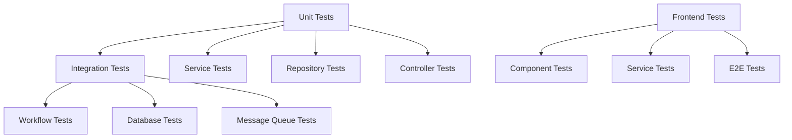
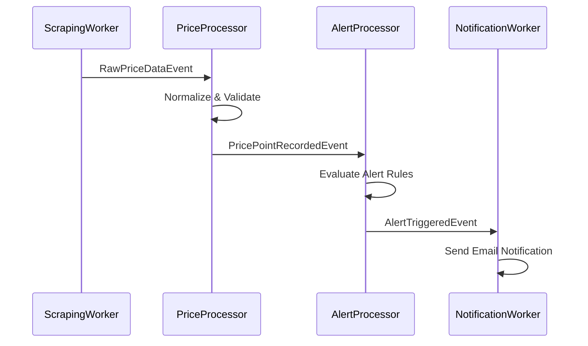
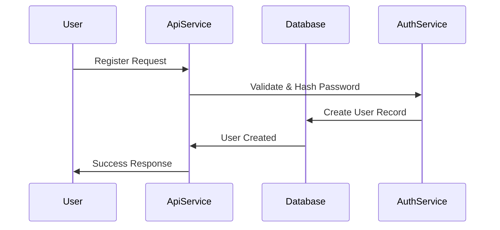

# Comprehensive Testing Plan for TechTicker Application

## 📋 Overview

This plan covers comprehensive unit and integration testing for the TechTicker price monitoring application, targeting 80%+ code coverage across all projects.

## 🏗️ Architecture Analysis

Based on my examination, the TechTicker application follows a clean architecture pattern with:

- **Domain Layer**: Core entities (AlertRule, Product, Category, etc.)
- **Data Access Layer**: Repository pattern with EF Core
- **Application Layer**: Business logic services and messaging
- **API Service**: Controllers and endpoints
- **Worker Services**: Background processing (Scraping, Notifications)
- **Frontend**: Angular SPA with feature modules

## 📊 Testing Strategy by Project



## 🎯 Testing Priorities

### 1. **Domain Layer Tests** (TechTicker.Domain.Tests)
- **Entity Validation Tests**: Property validation, business rules
- **Entity Behavior Tests**: Computed properties (e.g., `AlertRule.RuleDescription`)
- **Entity Relationship Tests**: Navigation properties

### 2. **Data Access Layer Tests** (TechTicker.DataAccess.Tests)
- **Repository Unit Tests**: CRUD operations with in-memory database
- **Unit of Work Tests**: Transaction management
- **Query Tests**: Complex queries and filtering
- **Integration Tests**: Real database scenarios

### 3. **Application Layer Tests** (TechTicker.Application.Tests)
- **Service Unit Tests**: Business logic with mocked dependencies
- **Messaging Tests**: RabbitMQ publisher/consumer
- **Mapping Tests**: DTO/Entity conversions
- **Integration Tests**: End-to-end service workflows

### 4. **API Service Tests** (TechTicker.ApiService.Tests)
- **Controller Unit Tests**: HTTP endpoints with mocked services
- **Integration Tests**: Full API workflows
- **Authentication/Authorization Tests**
- **Model Validation Tests**

### 5. **Worker Service Tests**
- **TechTicker.ScrapingWorker.Tests**: Web scraping logic, data processing
- **TechTicker.NotificationWorker.Tests**: Email processing, alert handling
- **Background Service Tests**: Service lifecycle, message processing

### 6. **Shared Components Tests** (TechTicker.Shared.Tests)
- **Common Utilities Tests**: Extensions, helpers
- **Base Controller Tests**: Shared functionality
- **Configuration Tests**: Settings validation

### 7. **Frontend Tests** (Angular)
- **Component Tests**: UI components, user interactions
- **Service Tests**: HTTP services, state management
- **Integration Tests**: Feature workflows
- **E2E Tests**: Critical user journeys

## 🧪 Detailed Testing Components

### High-Priority Test Cases

#### **AlertProcessingService Tests**
```csharp
- ProcessPricePointAsync_ValidPricePoint_TriggersAppropriateAlerts
- ProcessPricePointAsync_PriceBelowThreshold_TriggersAlert
- ProcessPricePointAsync_PercentageDropExceeded_TriggersAlert
- ProcessPricePointAsync_BackInStock_TriggersAlert
- ProcessPricePointAsync_NotificationFrequencyNotMet_SkipsAlert
- TriggerAlertAsync_ValidAlert_UpdatesLastNotifiedTime
- ShouldTriggerAlert_InvalidConditionType_ReturnsFalse
```

#### **WebScrapingService Tests**
```csharp
- ScrapeProductPageAsync_ValidPage_ReturnsCorrectData
- ScrapeProductPageAsync_InvalidSelectors_HandlesGracefully
- ExtractPrice_VariousPriceFormats_ParsesCorrectly
- ExtractStockStatus_DifferentStockTexts_NormalizesCorrectly
- ScrapeProductPageAsync_NetworkError_HandlesException
```

#### **Repository Tests**
```csharp
- GetActiveAlertsForProductAsync_ValidProduct_ReturnsActiveAlerts
- GetPagedAsync_WithFilters_ReturnsCorrectPage
- GetMappingsDueForScrapingAsync_ReturnsOnlyDueMappings
- Transaction_Rollback_UndoesChanges
```

### Integration Test Scenarios

#### **Price Alert Workflow**


#### **User Management Workflow**


## 🔧 Testing Infrastructure Setup

### **Test Data Builders**
```csharp
public class AlertRuleBuilder
{
    public AlertRuleBuilder WithPriceBelowCondition(decimal threshold)
    public AlertRuleBuilder WithPercentageDropCondition(decimal percentage)
    public AlertRuleBuilder WithUser(Guid userId)
    public AlertRule Build()
}
```

### **Mock Configurations**
- **Repository Mocks**: Consistent test data scenarios
- **Message Publisher Mocks**: Verify message publishing
- **External Service Mocks**: HTTP clients, email services

### **Test Database Strategy**
- **Unit Tests**: In-memory Entity Framework database
- **Integration Tests**: Test containers with real database
- **Test Data Seeding**: Consistent test scenarios

## 📈 Code Coverage Targets

| Project | Target Coverage | Focus Areas |
|---------|----------------|-------------|
| Domain | 90%+ | Entity validation, business rules |
| DataAccess | 85%+ | Repository queries, transactions |
| Application | 85%+ | Business logic, message handling |
| ApiService | 80%+ | Controllers, validation |
| Workers | 80%+ | Background processing, scraping |
| Shared | 85%+ | Common utilities |
| Frontend | 75%+ | Components, services |

## 🚀 Implementation Plan

### **Phase 1: Core Business Logic** (Week 1)
1. Domain entity tests
2. Application service tests (AlertProcessingService, MappingService)
3. Repository unit tests

### **Phase 2: API & Integration** (Week 2)
1. Controller tests
2. API integration tests
3. Database integration tests

### **Phase 3: Worker Services** (Week 3)
1. ScrapingWorker tests
2. NotificationWorker tests
3. Message queue integration tests

### **Phase 4: Frontend & E2E** (Week 4)
1. Angular component tests
2. Service tests
3. Critical path E2E tests

### **Phase 5: Performance & Load** (Week 5)
1. Performance tests for scraping
2. Load tests for API endpoints
3. Message queue throughput tests

## 🛠️ Testing Tools & Frameworks

### **.NET Backend**
- **xUnit**: Primary testing framework
- **FluentAssertions**: Readable assertions
- **Moq**: Mocking framework
- **Testcontainers**: Integration testing with real databases
- **Microsoft.AspNetCore.Mvc.Testing**: API testing
- **Coverlet**: Code coverage collection

### **Angular Frontend**
- **Jasmine/Karma**: Unit testing
- **Angular Testing Utilities**: Component testing
- **Cypress**: E2E testing
- **Istanbul**: Code coverage

### **Additional Tools**
- **ReportGenerator**: Coverage reporting
- **SonarQube**: Code quality analysis
- **Stryker.NET**: Mutation testing

## 📋 Success Metrics

- **Code Coverage**: 80%+ across all projects
- **Test Count**: 500+ comprehensive tests
- **Build Pipeline**: All tests pass in CI/CD
- **Performance**: Tests complete in <5 minutes
- **Maintainability**: Clear, readable test code

## 🔍 Test Categories by Project

### TechTicker.Domain.Tests
- Entity validation tests
- Business rule tests
- Property calculation tests (RuleDescription, etc.)

### TechTicker.DataAccess.Tests
- Repository CRUD operations
- Complex query tests
- Transaction management
- Unit of Work patterns

### TechTicker.Application.Tests
- AlertProcessingService comprehensive tests
- MappingService DTO conversion tests
- RabbitMQ messaging tests
- ScrapingOrchestrationService tests

### TechTicker.ApiService.Tests
- Controller action tests
- Authentication/authorization
- Model validation
- API integration tests

### TechTicker.ScrapingWorker.Tests
- WebScrapingService tests
- PriceDataProcessingService tests
- Background service lifecycle

### TechTicker.NotificationWorker.Tests
- EmailService tests
- Alert notification processing
- Worker service tests

### TechTicker.Shared.Tests
- Common utility tests
- Base controller tests
- Configuration validation

### TechTicker.ServiceDefaults.Tests
- Extension method tests
- Service registration tests

## 📝 Implementation Notes

1. **Start with Domain and Application layers** - these contain the core business logic
2. **Use test data builders** for consistent test scenarios
3. **Mock external dependencies** to ensure unit test isolation
4. **Integration tests should cover critical workflows** like price alert processing
5. **Frontend tests should focus on user interactions** and service integrations
6. **Performance tests should validate scraping efficiency** and API response times

This comprehensive testing approach will ensure high code quality, maintainability, and confidence in the TechTicker application's functionality.